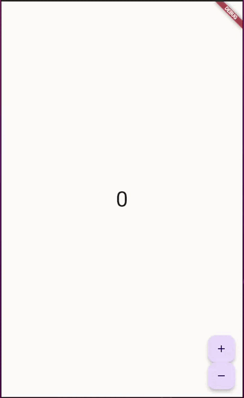

# Challenge

## What will you do
You are going to build an app following a feature-driven directory structure like this:



The feature to be developed will be a Counter capable of emitting a new state for a single integer (int) value. This Counter should be able to add and subtract a unit from the current state.

This small application will serve as a basis for future projects that integrate this feature as a **game mechanic**.

## Project structure

I suggest the next structure, which is already in this directory (`challenge`):
```
└── 📁lib
    └── app.dart
    └── 📁counter
        └── counter.dart
        └── 📁cubit
            └── counter_cubit.dart
        └── 📁view
            └── counter_page.dart
            └── counter_view.dart
            └── view.dart
    └── counter_observer.dart
    └── main.dart
```

Where the `view.dart`and the `counter.dart`work as **Barrels**. If you still don't know this term well, don't worry and try to develop the rest of the App with complete imports for each file you need to import from your Counter.

*Have fun!*