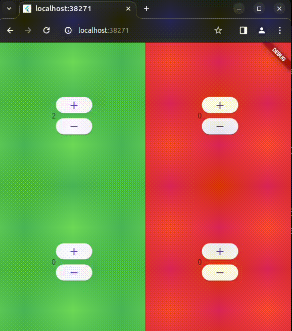

# Challenge

## What will you do
You are going to build an app following a feature-driven directory structure like this:


As you can see, we have used the concept of the Counter that we created in the previous exercise. And, the aim of this mini-game is to "balance" the corners. So that, a random secret integer will be generated for each corner. The user will find this integers using a counter feature. When the user reaches the integer, a green color warning will denote it. This secret integer should be limited to a 0-9 range.

## Project structure
```
└── 📁lib
    └── app.dart
    └── 📁counter
        └── counter.dart
        └── 📁cubit
            └── counter_cubit.dart
        └── 📁view
            └── counter_page.dart
            └── counter_view.dart
            └── view.dart
    └── main.dart
```
In this case, we will keep the same structure. However, `counter_cubit`is going to be modified to manage the logic of the 4 `int` states.  In addition, of course, the `counter_view`will change.

*Have fun!*
