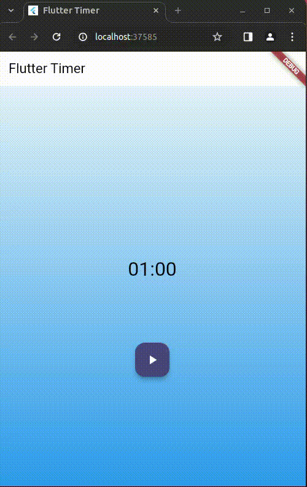

# Challenge

## What will you do
You are going to build an app following a feature-driven directory structure like this:



It's a Timer of 60 seconds duration based on the [tutorial](https://bloclibrary.dev/tutorials/flutter-timer/) of the official documentation. Remember that we will use this timer as a mechanics in the further exercises.

You will need to create a Stream of integers values which you will subscribe from your Timer feature. Since create this Stream could be a little tricky, here you have the code:

```flutter
class Ticker {
  const Ticker();
  Stream<int> tick({required int ticks}) {
    return Stream.periodic(const Duration(seconds: 1), (x) => ticks - x - 1)
        .take(ticks);
  }
}
```
Following, you will subscribe to this Ticker with something similar to:
```flutter
_tickerSubscription = _ticker
        .tick(ticks: event.duration)
        .listen()
```

## Project structure

I suggest the next structure, which is already in this directory (`challenge`):
```
└── 📁lib
    └── app.dart
    └── main.dart
    └── ticker.dart
    └── 📁timer
        └── 📁bloc
            └── timer_bloc.dart
            └── timer_event.dart
            └── timer_state.dart
        └── timer.dart
        └── 📁view
            └── timer_page.dart
```


Where the `timer.dart`works as **Barrel**.  Be aware about the Bloc proposal. This time we will work with Blocs and not with Cubit. Some information about what is a Bloc is [here](https://bloclibrary.dev/bloc-concepts/#:~:text=global%20BlocObserver%20override.-,Bloc,-A%20Bloc%20is).

*Have fun!*